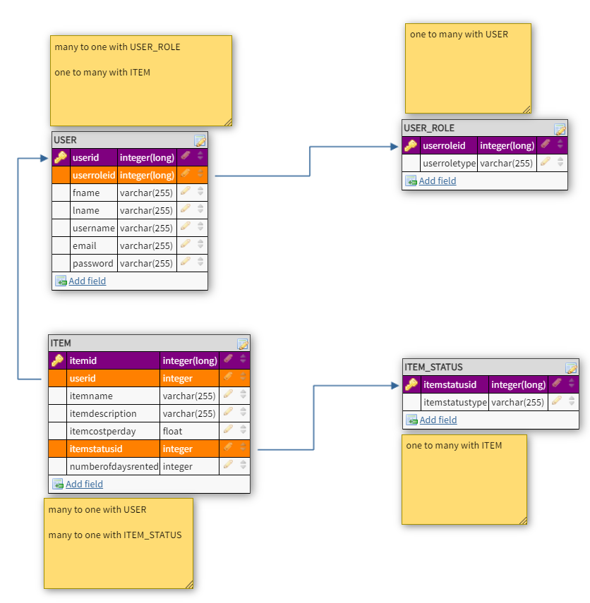

# Backend

## Introduction

This is a basic database scheme with Users, Items, UserRole, and ItemStatus. 
This Java Spring REST API application will provide the data modeling to support 
the client side of the Use My Tech Stuff application.

### Database layout

The table layouts are as follows:

## API Documentation

<a href="https://documenter.getpostman.com/view/14315106/TWDdiZB9">Link to POSTMAN API Documentation</a>